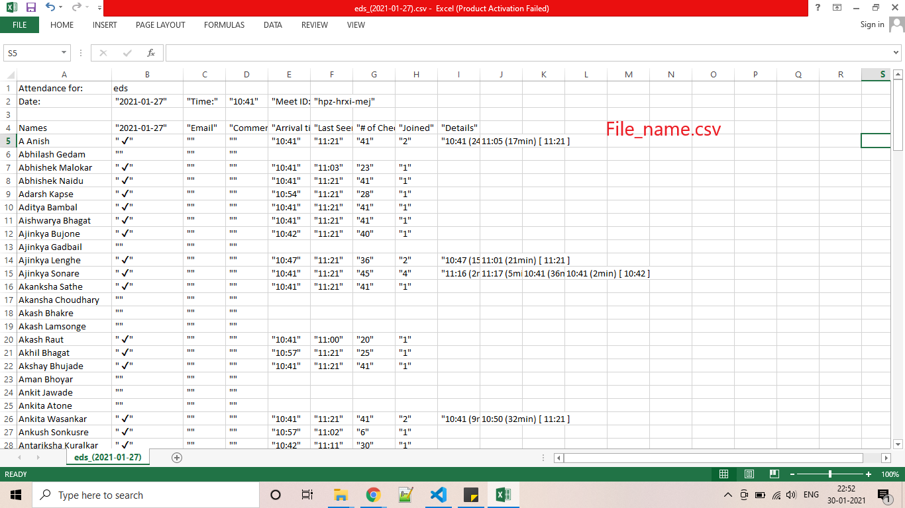
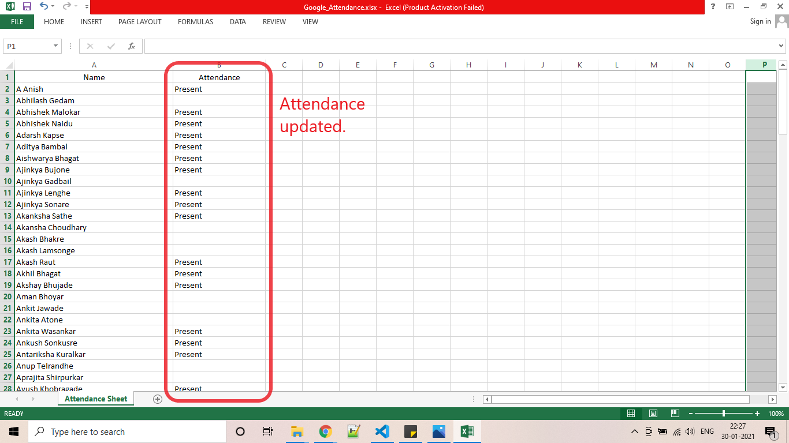

# csv-scrapping

This is the python code which takes *file_name.csv* as input  created from the extension "[Google meet Attendance](https://chrome.google.com/webstore/detail/google-meet-attendance/fkdjflnaggakjamjkmimcofefhppfljd?hl=en)" ( An extension to continuous monitor the participants of Google meet.) and marks the present participants from meet as "***present***" in output Spreadsheet *Google_Attendance.xlsx*.
Input file_name.csv            |  Output Google_Attendance.xlsx
:-------------------------:|:-------------------------:
  |  
## Prerequisites:
   Make sure, you have
1. Csv file ***file_name.csv*** containing data from google meet.
2. Installed *Python, Openpyxl and pandas*.
3. Created output sheet ***Google_Attendance.xlsx*** with list of total students.

## Steps:

### 1. Cloning the repository on local:

   - Go to the repository and download the code to your local computer.
    <kbd></img></kbd>

   - Extract the zip file.
   - You will see files following repository files.

   <kbd></img></kbd>

   

> **Make sure to move** ***file_name.csv*** **file into the same folder as that of code (Repository Folder)**

### 2. Setting up Output Sheet:

   - You will see ***Google_Attendance.xlsx*** file, this is the output file where you will have list of students and among them students present in Google meet will be marked as "***present***" in preceding column.

<kbd></img></kbd>

   - so, edit this spreadsheet and add your list instead of mine.

### 3. Installing Python, Openpyxl and Pandas:

> **skip this step, If you have already installed Python, Openpyxl and pandas**

   - Open command prompt, for windows "window+R">Type cmd>enter
   - for python:
   <code>pip install python</code>
   - for Openpyxl:
   <code>pip install openpyxl</code>
   - for pandas:
   <code>pip install pandas</code>

### 4. Running the code:

Now, we have gathered all pieces together, let's run the code.

   - Open the repository folder.
   - click *shift + Right mouse key* to open Powershell window in that drectory.
   - run this command: <code>python csv-scrapper.py</code>
   - It will then ask you to enter name of csv file in this format ***file_name.csv***

   <kbd></img></kbd>

   - Hit Enter and that's it. you will get success messege.

   <kbd></img></kbd>

   - Now check Google_Attendance.xlsx with updated data.

   <kbd></img></kbd>

### Author:

[Shantanu Nighot] (https://magbanum.live)
